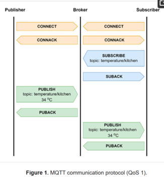

(from paper: A Multi-Tier MQTT Architecture with Multiple Brokers Based on Fog Computing for Securing Industrial IoT)
Message Queue Telemetry Transport (MQTT) 
MQTT is a messaging protocol based on the publish–subscribe model, which is similar to the client–server model, but the server running MQTT is called a broker. The protocol is designed for resource-constrained devices and low-bandwidth and high-latency networks, and it attempts to provide reliability and ensure data delivery. In addition, it is ideal for mobile IoT applications and machine-to-machine (M2M) communication. MQTT provides bidirectional communication between clients (publisher/subscriber) and a broker. The publisher is decoupled from the subscriber, and there is no direct communication between the publisher and the subscriber, except through the broker, which handles, filters, and distributes the messages between the clients. As shown in Table 1, MQTT has 14 types of messages that are sent to and received from the broker. Security in MQTT is a username/password-based authentication in plain text that is protected by the cryptographic protocol Secure Sockets Layer/Transport Layer Security (SSL/TLS). This protocol is not considered to be lightweight for resource-constrained devices and increases the computational, communication, and storage overhead.

MQTT defines three quality-of-service (QoS) levels: QoS 0, QoS 1, and QoS 2. In QoS 0 (at most once), the publisher sends the message one time to the broker, which in turn sends it one time to the subscriber. No acknowledgment will be sent by the receiver, and the message will not be resent by the sender. QoS 1 (at least once) is the default level used in MQTT, and it guarantees that the PUBLISH message from the publisher to broker, and then from the broker to subscriber, is delivered at least one time. In other words, if an acknowledgment of the message (PUBACK) is not obtained by the receiver, the sender (either the publisher or broker) will resend the message. Finally, QoS 2 (exactly once) is utilized when message loss and duplication are not acceptable. QoS 2 performs a two-step acknowledgment (PUBLISH–PUBREC) and (PUBREL–PUBCOMP) process to ensure that the message is delivered one time. This level is more reliable but increases the communication overhead.
 
